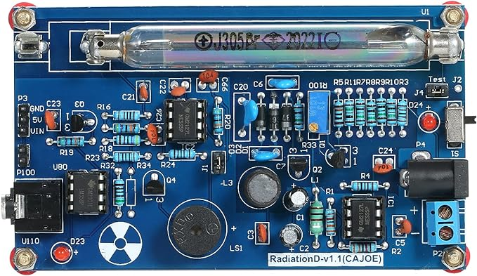
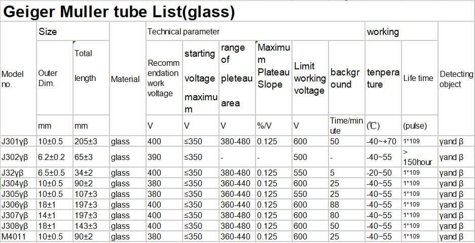
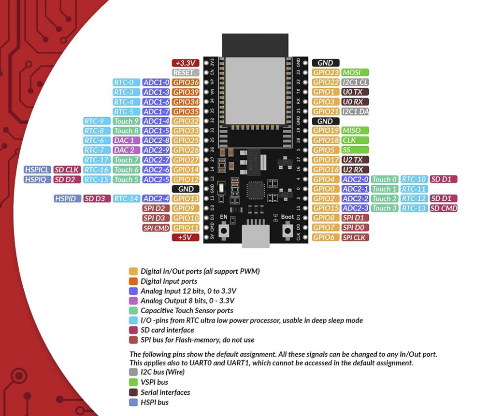

## A __TRUE__ random number generator

Generating a random number - true random numbers, not the pseudo-random numbers generated in every language - is a bit involved.

In this project, I use the entropy in the background radioactivity to generate these numbers.

### What is background radiation?

[Wikipedia defines](https://en.wikipedia.org/wiki/Background_radiation) background radiation as the level of ionising radiation present in the environment at a particular location that is not due to the deliberate introduction of radiation sources.

There are both terrestrial and extraterrestrial sources of it.
Low, naturally occurring ores of potassium-40, uranium-238, and thorium-232 form most of the terrestrial sources. Plus radon-222, which is a gas that naturally emanates from the ground - various obviously by location, ventilation, and season.

Extraterrestial sources are primarily from cosmic rays, which are high-energy photons. When they slam into atomic neuclei in the upper atmosphere, they set off a shower of sub-atomic pions, which then decay into muons. 10,000 of them, on average roughly per square metre per minute, travelling at nearly the speed of light.

### So how is this random?
Even though the decay of a large number of atoms can be predicted by it's half life, the decay of a single ratioactive atom is guaranteed to be unpredictable by the laws of quantum physics.

### How to detect this?
We will use a Geiger-Muller counter. Yes, the same clicky things from the movies. Good ones used for actual safety detection are pretty pricey. But for our purposes, a cheap one - one that might not detect all ambient radiation is no problem. I bought an unassembled kit as a kit for around £20 as I loved the opportunity to solder some simple through-hole components. You can get a fully assembled kit for around £22 [here](https://www.amazon.co.uk/dp/B09X1H5CW4/ref=sspa_dk_detail_2?psc=1&pd_rd_i=B09X1H5CW4&pd_rd_w=UmAAH&content-id=amzn1.sym.84ea1bf1-65a8-4363-b8f5-f0df58cbb686&pf_rd_p=84ea1bf1-65a8-4363-b8f5-f0df58cbb686&pf_rd_r=6T91H92ET624VQBF90ZP&pd_rd_wg=13Ojw&pd_rd_r=af5cdccb-5bdb-4c70-9fa1-ba008338d04c&s=diy&sp_csd=d2lkZ2V0TmFtZT1zcF9kZXRhaWw) (link might expire). 
 
 
The only thing to ensure is that the board is the same as below: __RadiationD-v1.1(CAJOE)__

If you want, you can replace the Chinese J tube with a Russian SBM-20 tube if you will use this to work as a radiation detector. [Tube comparisons](https://sites.google.com/site/diygeigercounter/technical/gm-tubes-supported) can be consulted for a better fit. Below is a chart of characteristics of the J tubes that usually come in the package.

How a Geiger-Muller detector works is pretty clever - explanation [on Wikipedia](https://en.wikipedia.org/wiki/Geiger_counter)

### How do we use detection to generate random numbers?
Well, this is fairly simple: we can count the time in between detections. As the events are random, the time interval between them is also random.

We can use any microcontroller or even a decade counter chip or circuit to do this. But I wanted an API end point, so any computer on the network could request a random number from this. I used an ESP32 for the following reasons:
- inbuilt WiFi: I can connect to my router and respond to requests.
- dual-core: one core can generate the random numbers in real time while the other listens and responds to the API endpoints.

A ESP32 dev board costs ~£10, like [this](https://www.amazon.co.uk/AZDelivery-Development-Unsoldered-including-Successor/dp/B08BTS62L7/ref=sxin_14_pa_sp_search_thematic_sspa?content-id=amzn1.sym.f6fbf3b3-e08a-4fcc-8bb1-2b8aafa7a1e7%3Aamzn1.sym.f6fbf3b3-e08a-4fcc-8bb1-2b8aafa7a1e7&crid=69CBJ2R4HCT5&cv_ct_cx=esp32+development+board&keywords=esp32+development+board&pd_rd_i=B08BTS62L7&pd_rd_r=adc2a27a-d7ee-4104-9ded-32dfd4ced52b&pd_rd_w=j95Ap&pd_rd_wg=67HLM&pf_rd_p=f6fbf3b3-e08a-4fcc-8bb1-2b8aafa7a1e7&pf_rd_r=F8X402S1RVACM4WH99J0&qid=1706374947&sbo=RZvfv%2F%2FHxDF%2BO5021pAnSA%3D%3D&sprefix=esp32%2Caps%2C90&sr=1-2-ad3222ed-9545-4dc8-8dd8-6b2cb5278509-spons&sp_csd=d2lkZ2V0TmFtZT1zcF9zZWFyY2hfdGhlbWF0aWM&psc=1) (The link might expire.)

The 3 connections between the ESP32 and the Geiger-Muller (GM) detecter board that we need are:

1. ESP +5v to GM P3 5v pin (we will run the detector from the USB plugged into the ESP32, so it's a single-wire system)
1. ESP GND to GM P3 GND (common ground; this is needed even if you power the boards separately).
1. ESP pin 13 (configured in main.cpp) to GM P3 Vin pin

### How does the ESP32 work with the detector?

The ESP32 controller has two cores.
Core 1:

Core 1 will set up an interrupt on pin 13 (the pin connected to the GM detector) and start counting from 0 to 35565, resetting back to 0 if it goes over.
When the GM counter gets triggered, the program will save the current number it was on.
The number is saved in a queue - a FIFO data structure.  
Then it will reset the counter to 0 and start all over again.  
It will continue to fill the queue with random numbers until the queue is full (configured to 50,000 numbers).

Core 2:

Core 2 will set up a wifi connection, obtain an IP address, and listen for GET requests on its endpoint.  
If it receives a request to check the current queue depth, it will return the depth as an integer.  
If it receives a request for a random number, it will pop the first number in the queue and return it.
Optionally, the random number request can specify the _"max"_ (instead of the default max of 65535). The program then converts the saved random number (0-65535) to the requested range (0-_"max"_) and sends it through.  
While doing so, to retain the entropy of the original number, it discards the number it picks from the queue that is greater than the largest integral multiple of _"max"_ which is less than 65535.

Some weaknesses:
- Slow generation. But you should be worried if the generation is quick - as that will imply you're in a high radiation environment :-)

